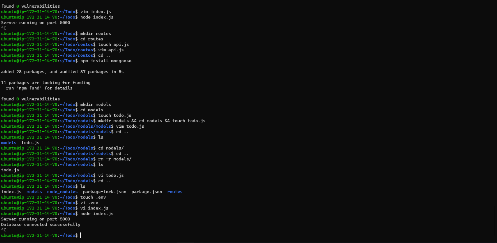

# Project 3 - MERN Stack Implementation
___
___
## **Step 1 BACKEND CONFIGURATION**
___
>### Installing Ubuntu’s package manager ‘apt’

#### To update a list of packages in package manager for Node like apt for Ubuntu the following set of commands are run;
* *`sudo apt update`* - (Updated Ubuntu)
* *`sudo apt upgrade`* - (Upgrades Ubuntu)

#### Installing Node.js Files
* *`curl -fsSL https://deb.nodesource.com/setup_18.x | sudo -E bash -`* - (Gets the location of Node.js software from Ubuntu repositories.)
* *`sudo apt-get install -y nodejs`* - (Install Node.js on the server)
* *`node -v `* - (Checks version of Node)
* *`npm -v`* - (Checks version on NPM. NPM is a package manager for Node like apt for Ubuntu, it is used to install Node modules & packages and to manage dependency conflicts.)

>### Application  Setup
#### Create a new directory for your To-Do project
* *`mkdir Todo`* - (Creates Directory Todo)
* *`cd Todo`* - (Enters into the Ditectory)
* *`npm init`* - ( Initialize the project with a package.json file This file will normally contain information about your application and the dependencies that it needs to run.)

>### Node Server Setup
#### To run a JavaScript code on the backend, there is need to spin up a server that will compile the code. The following commands were implemented
* *`npm install express`* - (Express helps to define routes of the application based on HTTP methods and URLs)
* *`touch index.js`* - (Create a file index.js)
* *`npm install dotenv`* - (Installs the dotenv module)
* *`node index.js`* - (Starts up the server and displays Server running on port 5000 )

>### Creating the routes & defining the models
#### There are three things that the app needs to do
* *`create a task`* 
* *`Display list of all tasks`* 
* *`Delete a completed task`* 
##### To create the Direectories and coressponding files
* *`mkdir routes`* - (create routes that will define various endpoints that the To-do app will depend on)
* *`cd routes`* - (Enters into the Directory)
* *`touch api.js`* - (Create a file api.js)
* *`npm install mongoose`* - (create routes that will define various endpoints that the To-do app will depend on, MongoDB which is a NoSQL database will be used)
* *`mkdir models`* - (Creates a model folder that is heart of JavaScript based applications, and it is what makes it interactive.)
* *`touch todo.js`* - (Create a file todo.js)

>### Connecting to the Database & Testing the API
##### A Non SQL Database MongoDB is created and APi is tested using POSTMAN

## **Step 2 FRONTEND CREATION**
___

>### Creating and Running an interface for client to Interact with the API
#### To created and run the React App following set of commands are run;
* *`npx create-react-app client`* - (Creates a new folder in  Todo directory called client, where all the React code will be added)
* *`npm install concurrently --save-dev`* - (Runs more than one command simultaneously from the same terminal window)
* *`npm install nodemon --save-dev`* - (Runs and monitor the server. If there is any change in the server code, nodemon will restart it automatically and load the new changes)
* *`vi package.json`* - (Opens a text editor window to edit the package.json file)
* *`cd client`* (Enters into the directory while still in Todo directory)
* *`vi package.json`* - (Opens a text editor window to edit the package.json file in client directory)
* *`npm run dev`* - (In the Todo Directory Runs the App)
* *`cd src`* (Enters into the src directory while still in Client directory)
* *`mkdir components`* (Creates a new folder in src directory called components)
* *`cd components`* (Enters into the src directory while still in src directory)
* *`touch Input.js ListTodo.js Todo.js`*  (Creates files in components directory called Input.js ListTodo.js Todo.js)
* *`vi Input.js`*  (Opens a text editor window to edit the Input.js file)
* *`npm install axios`* (In the Client directory the command Installs Axios is a promise based HTTP client for the browser and Node.js. Axios makes it easy to send asynchronous HTTP requests to REST endpoints and perform CRUD operations)
* *`cd src/components`* (Commands Access the components directory in the src directory)
* *`vi ListTodo.js`*  (Opens a text editor window to edit the ListTodo.js file)
* *`vi Todo.js`*  (Opens a text editor window to edit the Todo.js file)
* *`vi App.js`*  (Back into the scr directory command Opens a text editor window to edit the App.js file)
* *`vi App.css`*  (Back into the scr directory command Opens a text editor window to edit the App.css file)
* *`vim index.css`*  (Back into the scr directory command Opens a text editor window to edit the App.css file)
* *`npm run dev`*  (In the Todo Directory Runs the App)

